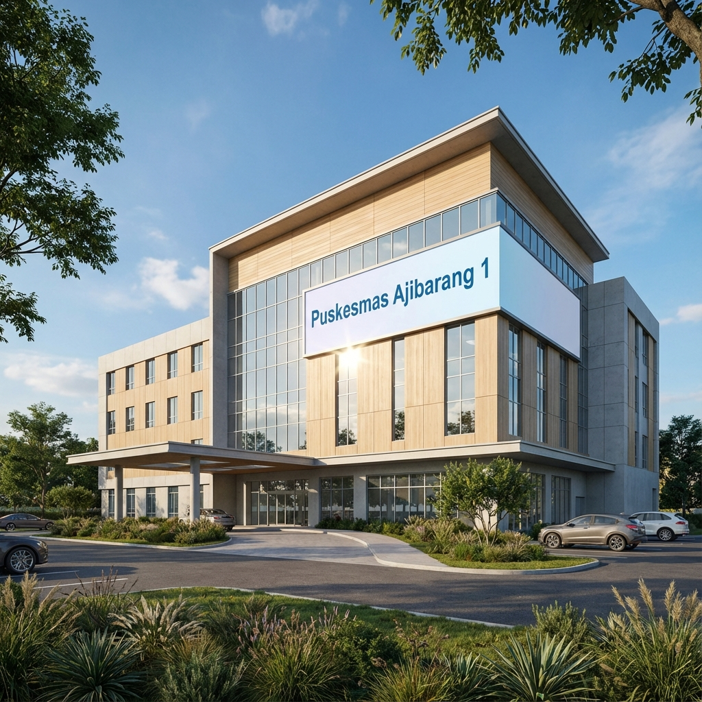

# Sistem Pendaftaran & Antrian Online Puskesmas Ajibarang



Platform manajemen layanan kesehatan modern untuk Puskesmas Ajibarang, dirancang untuk mempermudah pendaftaran pasien, memantau antrian secara real-time, dan mengelola operasional puskesmas secara efisien.

Aplikasi ini dibangun menggunakan teknologi web modern untuk memastikan performa cepat, tampilan responsif, dan pengalaman pengguna yang premium.

## 🚀 Fitur Utama

### 1. Pendaftaran Pasien Online 📝

-   Formulir pendaftaran yang mudah digunakan dengan validasi NIK (16 digit).
-   Pemilihan poli tujuan dan dokter secara spesifik.
-   Sistem tiket antrian otomatis.
-   **Unified Auth**: Halaman login dan daftar yang terintegrasi dengan transisi halus.

### 2. Monitor Antrian Real-time 📺

-   Dashboard antrian publik yang diperbarui secara otomatis (auto-refresh setiap 5 detik).
-   Menampilkan nomor antrian yang sedang dipanggil dan sisa antrian.
-   Indikator visual audio/animasi saat nomor dipanggil.

### 3. Dashboard Admin & Petugas 👨‍💼

-   **Admin Dashboard**: Kelola data pasien, data dokter, dan pesan masuk.
-   **Leader Dashboard**: Halaman khusus untuk pimpinan melihat statistik dan laporan.
-   Manajemen status antrian (Panggil, Lewati, Selesai).

### 4. Halaman Informasi Publik ℹ️

-   **Beranda**: Overview layanan dan CTA pendaftaran.
-   **Profil**: Visi, Misi (Layout baru), dan Struktur Organisasi Dinamis (Tree Diagram).
-   **Layanan**: Daftar poli dan fasilitas kesehatan.
-   **Kontak**: Formulir pengaduan/pertanyaan dan peta lokasi.

## 🛠️ Teknologi yang Digunakan

Project ini dibangun di atas stack teknologi yang powerful dan modern:

-   **Backend Framework**: [Laravel 10](https://laravel.com) (PHP 8.1+)
-   **Frontend Interactivity**: [Livewire 3](https://livewire.laravel.com) - Full-stack framework untuk antarmuka dinamis.
-   **Styling**: [Tailwind CSS v3/v4](https://tailwindcss.com) - Framework CSS utility-first untuk desain custom yang cepat.
-   **JavaScript**: [Alpine.js](https://alpinejs.dev) - Framework JS ringan untuk interaksi UI sederhana.
-   **Database**: MySQL.

## ⚙️ Persyaratan Sistem

Sebelum menjalankan aplikasi, pastikan sistem Anda memiliki:

-   PHP >= 8.1
-   Composer
-   Node.js & NPM
-   MySQL Database

## 📦 Cara Install & Menjalankan Project

Ikuti langkah-langkah berikut untuk menjalankan project ini di komputer lokal Anda:

### 1. Clone Repository

```bash
git clone https://github.com/iqsanazhr/Puskesmas-Pendaftaran-dan-antrian.git
cd Puskesmas-Pendaftaran-dan-antrian
```

### 2. Install Dependensi PHP (Composer)

```bash
composer install
```

### 3. Install Dependensi Frontend (NPM)

```bash
npm install
```

### 4. Konfigurasi Environment

Salin file `.env.example` ke `.env`:

```bash
cp .env.example .env
```

Buka file `.env` dan sesuaikan konfigurasi database Anda:

```env
DB_CONNECTION=mysql
DB_HOST=127.0.0.1
DB_PORT=3306
DB_DATABASE=nama_database_anda
DB_USERNAME=root
DB_PASSWORD=
```

### 5. Generate Application Key

```bash
php artisan key:generate
```

### 6. Migrasi Database

Jalankan migrasi untuk membuat tabel-tabel yang dibutuhkan (pastikan database sudah dibuat di MySQL/phpMyAdmin):

```bash
php artisan migrate
# Atau jika ingin mengisi data dummy awal:
php artisan migrate:refresh --seed
```

### 7. Jalankan Aplikasi

Buka dua terminal terpisah untuk menjalankan server PHP dan build asset frontend:

**Terminal 1 (Laravel Server):**

```bash
php artisan serve
```

**Terminal 2 (Vite Development Server):**

```bash
npm run dev
```

Akses aplikasi di: `http://127.0.0.1:8000`

## 👥 Akun Demo (Jika Menggunakan Seeder)

Jika Anda menjalankan `db:seed`, Anda bisa menggunakan akun berikut untuk testing:

-   **Admin/Petugas**:

    -   Email: `admin@puskesmas.com`
    -   Password: `password`

-   **Pasien**:
    -   Email: `pasien@example.com`
    -   Password: `password`

## 🤝 Kontribusi

Kontribusi selalu diterima! Silakan fork repository ini, buat branch fitur baru, dan kirim Pull Request.

## 📄 Lisensi

Project ini dilisensikan di bawah [MIT License](https://opensource.org/licenses/MIT).

---

**Dibuat dengan ❤️ untuk Kesehatan Masyarakat Ajibarang**
