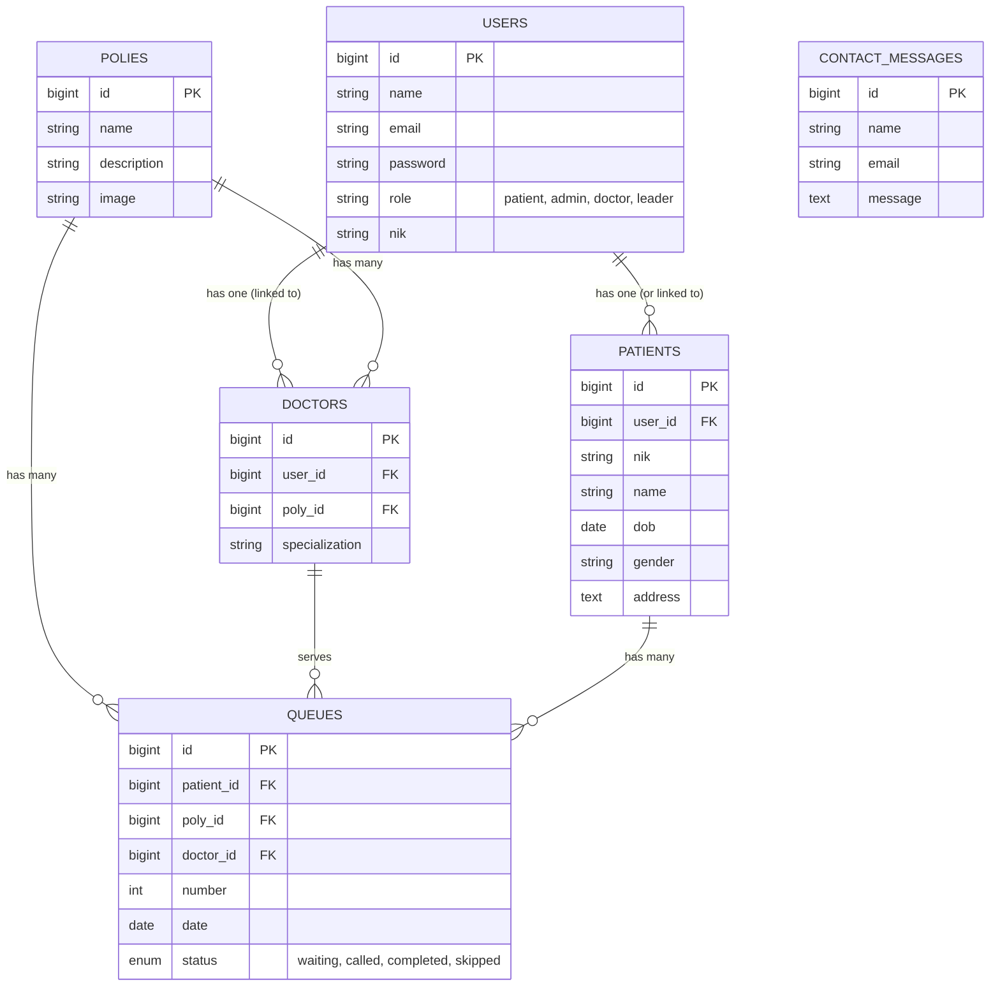
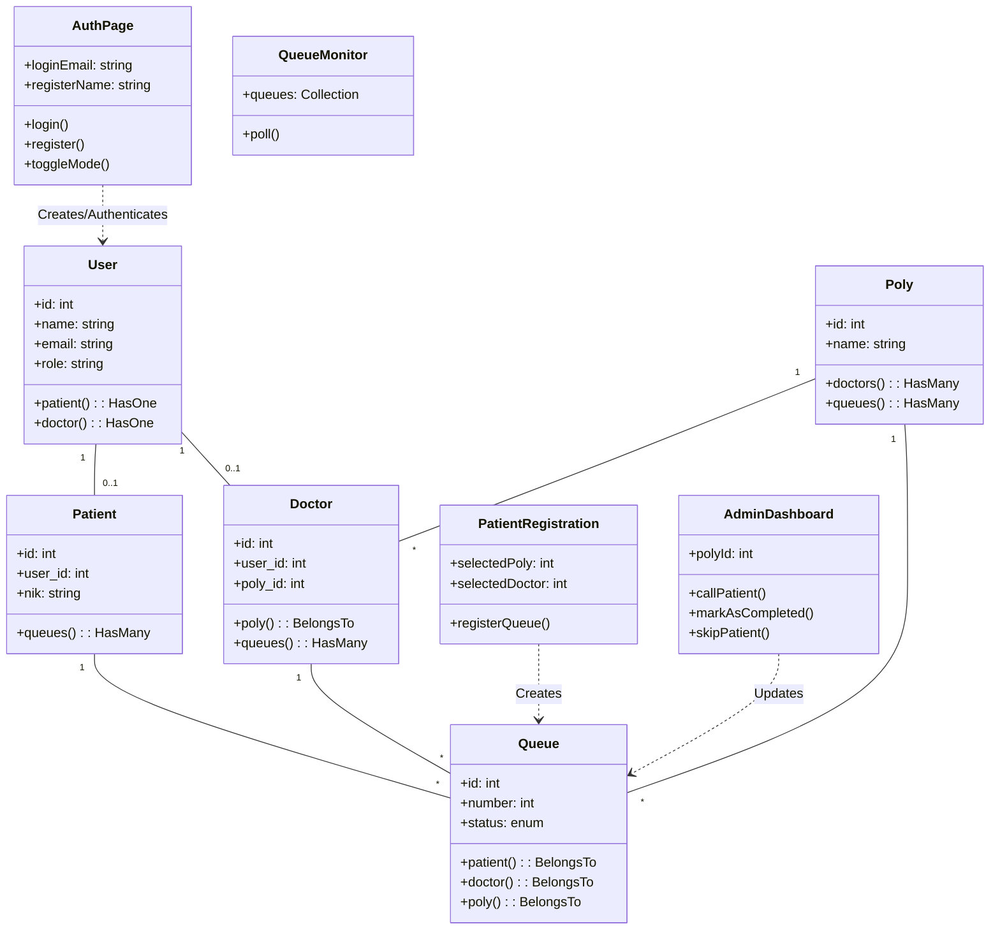

# Dokumentasi Desain Sistem Puskesmas Ajibarang

Dokumen ini berisi diagram dan tabel interaksi untuk memvisualisasikan arsitektur, alur kerja, dan struktur data dari Sistem Informasi Puskesmas Ajibarang.

---

## 1. Tabel Interaksi Fitur & Role

Tabel berikut menjelaskan hak akses dan fitur yang tersedia untuk setiap role pengguna:

| Fitur / Role                         |  Pasien (Patient)   |  Dokter (Doctor)  |  Admin / Petugas  | Pimpinan (Leader) |
| :----------------------------------- | :-----------------: | :---------------: | :---------------: | :---------------: |
| **Login / Register**                 |         ✅          |        ✅         |        ✅         |        ✅         |
| **Lihat Beranda & Info**             |         ✅          |        ✅         |        ✅         |        ✅         |
| **Daftar Antrian**                   |         ✅          |        ❌         | ✅ (Bantu Pasien) |        ❌         |
| **Lihat Riwayat Antrian**            | ✅ (Milik Sendiri)  |        ❌         |    ✅ (Semua)     |  ✅ (Statistik)   |
| **Monitor Antrian (Publik)**         |         ✅          |        ✅         |        ✅         |        ✅         |
| **Kelola Antrian (Panggil/Selesai)** |         ❌          | ✅ (Poli Terkait) |  ✅ (Semua Poli)  |        ❌         |
| **Kelola Data Pasien**               | ✅ (Profil Sendiri) |        ❌         |        ✅         |        ❌         |
| **Kelola Data Dokter & Poli**        |         ❌          |        ❌         |        ✅         |        ❌         |
| **Lihat Dashboard Statistik**        |         ❌          |        ❌         |        ❌         |        ✅         |
| **Kirim Pesan Kontak**               |         ✅          |        ❌         |        ❌         |        ❌         |
| **Baca Pesan Kontak**                |         ❌          |        ❌         |        ✅         |        ❌         |

---

## 2. Use Case Diagram

Diagram ini menggambarkan interaksi aktor dengan fitur-fitur utama sistem.

```mermaid
usecaseDiagram
    actor "Pasien" as P
    actor "Dokter" as D
    actor "Admin" as A
    actor "Pimpinan" as L

    package "Sistem Puskesmas" {
        usecase "Login / Register" as UC1
        usecase "Melihat Informasi (Layanan, Jadwal)" as UC2
        usecase "Daftar Antrian Online" as UC3
        usecase "Monitor Antrian Real-time" as UC4
        usecase "Mengelola Profil Diri" as UC5

        usecase "Memanggil Pasien (Kelola Antrian)" as UC6
        usecase "Mengelola Data Pasien" as UC7
        usecase "Mengelola Data Dokter/Poli" as UC8
        usecase "Melihat Pesan Masuk" as UC9

        usecase "Melihat Dashboard Statistik" as UC10
    }

    P --> UC1
    P --> UC2
    P --> UC3
    P --> UC4
    P --> UC5

    D --> UC1
    D --> UC6
    D --> UC4

    A --> UC1
    A --> UC6
    A --> UC7
    A --> UC8
    A --> UC9
    A --> UC3 : "Bantu Daftar"

    L --> UC1
    L --> UC10
```

---

## 3. Activity Diagram: Pendaftaran Antrian Pasien

Alur proses pasien mendaftar antrian hingga mendapatkan nomor.

```mermaid
activityDiagram
    participant Pasien
    participant Sistem
    participant Database

    start
    :Pasien Login;
    if (Sudah Punya Akun?) then (Ya)
        :Masuk ke Halaman Login;
        :Input Email & Password;
    else (Tidak)
        :Masuk ke Halaman Daftar;
        :Input Data Diri & NIK;
        :Simpan Data Akun;
    endif

    :Akses Menu "Daftar Antrian";
    :Pilih Poli Tujuan;
    :Pilih Dokter (Opsional);

    :Sistem Cek Jadwal & Kuota;
    if (Kuota Tersedia?) then (Ya)
        :Generate Nomor Antrian;
        :Simpan Data Antrian;
        :Tampilkan Tiket Antrian;
    else (Tidak)
        :Tampilkan Pesan Penuh;
        stop
    endif

    :Pasien Menunggu (Pantau Monitor);
    stop
```

---

## 4. Activity Diagram: Proses Pelayanan (Admin/Dokter)

Alur proses pemanggilan pasien oleh petugas medis.

```mermaid
activityDiagram
    participant Dokter_Admin
    participant Sistem

    start
    :Login sebagai Dokter/Admin;
    :Buka Dashboard Antrian;
    :Pilih Poli;

    repeat
        :Lihat Daftar Pasien Waiting;
        if (Ada Pasien Menunggu?) then (Ya)
            :Klik "Panggil Pasien";
            :Sistem Update Status -> "Called";
            :Bunyikan Notifikasi Panggilan;

            :Periksa Pasien;

            if (Pasien Hadir?) then (Ya)
                :Lakukan Pelayanan;
                :Klik "Selesai";
                :Sistem Update Status -> "Completed";
            else (Tidak)
                :Klik "Lewati";
                :Sistem Update Status -> "Skipped";
            endif
        else (Tidak)
            :Tunggu Pasien Baru;
        endif
    repeat while (Jam Operasional Masih Ada)

    stop
```

---

## 5. Entity Relationship Diagram (ERD)

Struktur database dan relasi antar tabel.



---

## 6. Class Diagram

Struktur kelas utama (Model & Livewire Component) dalam aplikasi.


