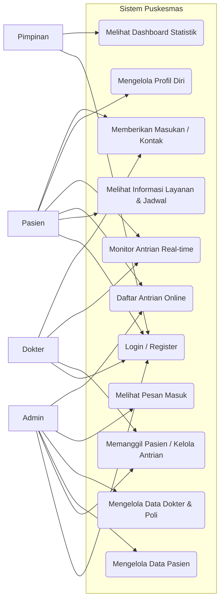
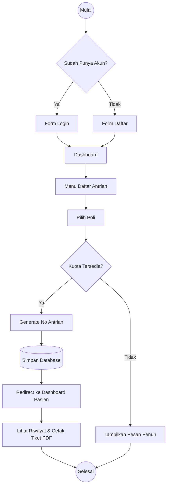
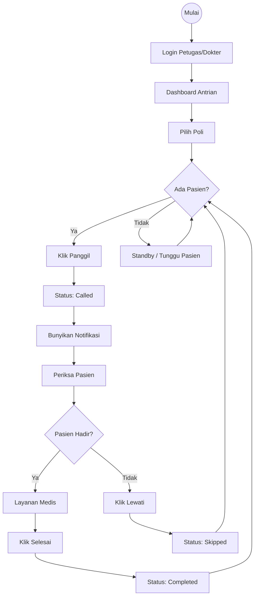
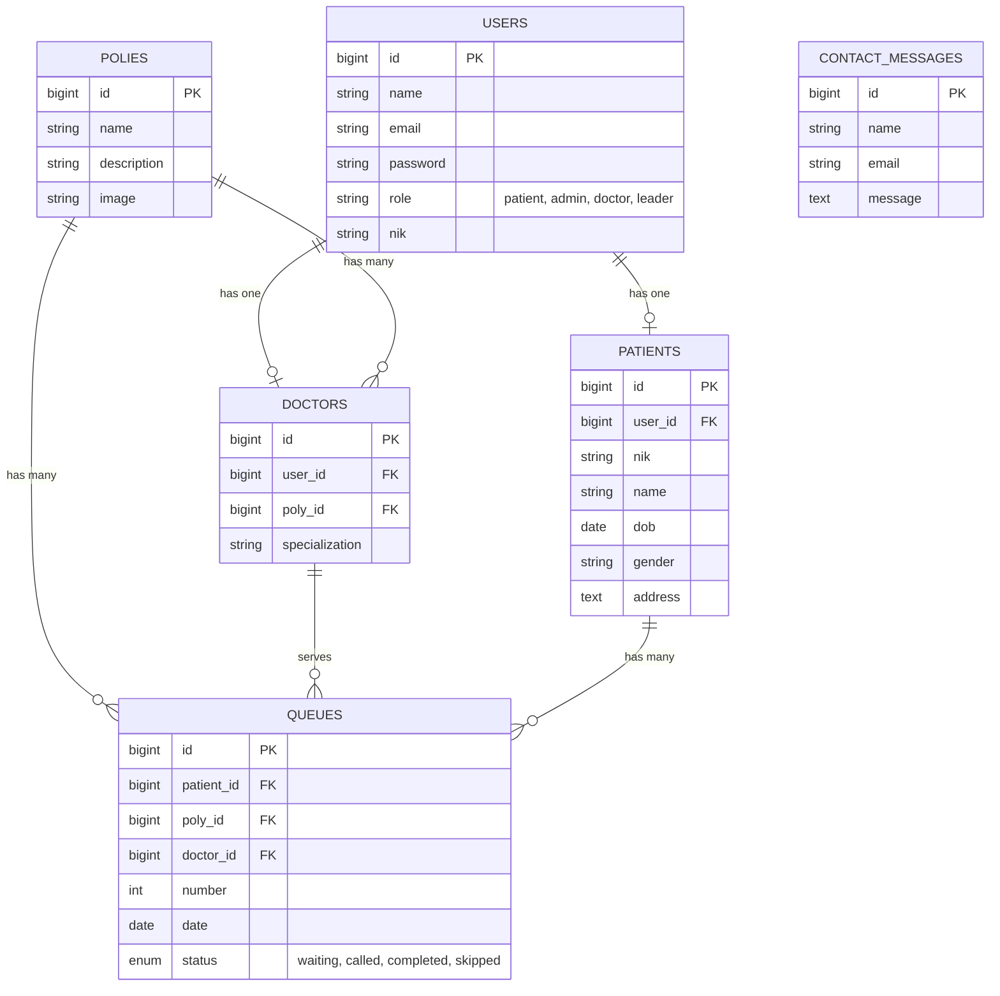
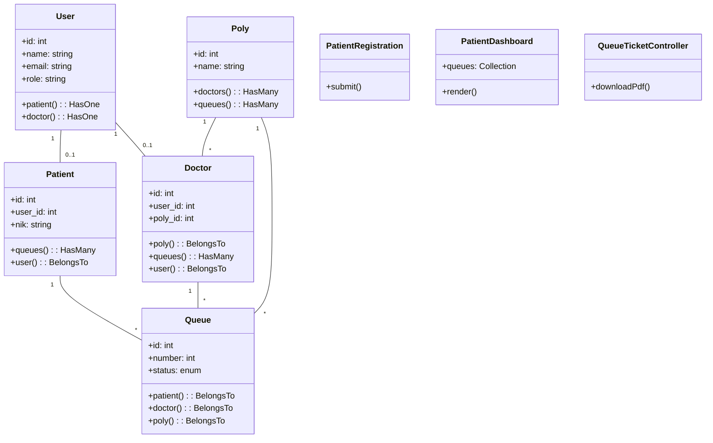

Dokumen ini berisi diagram dan tabel interaksi untuk memvisualisasikan arsitektur, alur kerja, dan struktur data dari Sistem Informasi Puskesmas Ajibarang.

**Catatan Hak Akses**:

-   **Admin**: Hanya bertugas memanggil antrian dan menampung masukan dari pasien dan dokter. Tidak memiliki akses untuk mengelola data pasien, data dokter, atau melakukan pendaftaran pasien.
-   **Dokter**: Hanya dapat memanggil antrian di poli yang ditugaskan.
-   **Pasien**: Mendaftar mandiri dan memantau antrian.

---

## 1. Use Case Diagram

Diagram ini menggambarkan interaksi aktor dengan fitur-fitur utama sistem.

---

## 2. Activity Diagram: Pendaftaran Antrian Pasien

Alur proses pasien mendaftar antrian hingga mendapatkan nomor.

---

## 3. Activity Diagram: Proses Pelayanan (Admin/Dokter)

Alur proses pemanggilan pasien oleh petugas medis.

---

## 4. Entity Relationship Diagram (ERD)

Struktur database dan relasi antar tabel.

---

## 5. Class Diagram

Struktur kelas utama (Model & Livewire Component) dalam aplikasi.

